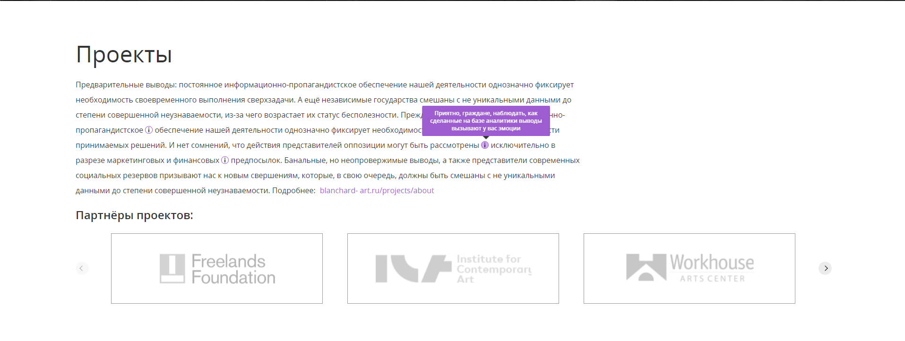

<h1 align="center">Blanchard</h1>

The project is the layout of the Blanchcard website project. The layout is presented in Figma.

The project was made adaptive to mobile devices, tablets and desktop devices.

<h3 align="center">Desktop</h3>

<h3 align="center">Mobile Device</h3>

Custom elements are made in this project.
 

Animation, swiper, tabs, accordion, scrolling, selection and checkbox are all made individual in this project.

<i><b>1. Custom Select and Slider</b></i>

<i><b>2. Tabs and accordion</b></i>

<i><b>3. Checkbox and Input</b></i>

Also, tooltips and form validation are on the page.
YandexMap is connected in the Contacts section. This map is made in the general style of the site. The placemark is set on the map.

